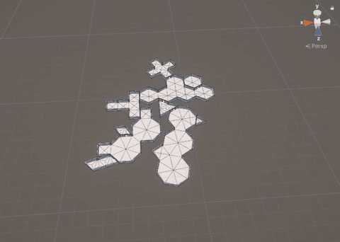

# Connected Rooms Generator (CRG)

Procedural level generation for Unity. CRG grows a set of connected rooms on a hexagonal, square, triangle or octagon + square grid, or mixes all of them in one level, where every room is a cluster of adjacent cells, and builds the whole level as **a single ProBuilder mesh** with floors, walls and door openings. Generation works both in the Editor and at runtime.

On top of the geometry it can add colliders, bake a NavMesh, place a door prefab in every doorway, create a spawn point in each room and mark start/end rooms, so a generated level is ready to play.

<p align="center">
  <a href="Documentation~/media/crg-demo.mp4"></a>
</p>

## Features

- **Four grid types, or all at once**: hexagons, squares, triangles and octagons + squares, or a mixed level where every room picks its own grid type by weight.
- **Hand-built levels**: build a level yourself, cell by cell, in the Scene view with a live preview, then bake it into one mesh or one mesh per room.
- **Connected by construction**: every room is reachable from the first one through doors. Each pair of connected rooms gets exactly one door, centered on a shared edge.
- **Single mesh output**: one `ProBuilderMesh` with separate floor, wall and ceiling material slots, still editable with ProBuilder tools. Walls can be zero-thickness planes or solid walls of any thickness, with optional ceilings. Optionally one mesh per room.
- **Reproducible**: the same seed and settings always produce the same level.
- **Layout control**: bias between compact and sprawling levels, and control how many loops the room graph has.
- **Gameplay-ready extras**: MeshColliders, NavMesh baking (optional package), door prefabs, per-room spawn points, start/end room roles and distance from the start.
- **Scene-view overlays**: room outlines and labels, door markers, the connection graph and start/end rooms.
- **Undo support** for levels generated from the Level Generator window and the CRG menus.

## Requirements

- Unity **2021.3** or newer (developed and tested with Unity 6000.3).
- **ProBuilder** (`com.unity.probuilder`) 5.0 or newer, installed automatically as a dependency (tested with 6.0.9).
- Optional: **AI Navigation** (`com.unity.ai.navigation`) 1.1 or newer for NavMesh baking. Without it, everything else works and NavMesh options show a warning.

## Installation

In Unity, open **Window → Package Manager**, click **+ → Add package from git URL…** and enter:

```
https://github.com/cosgunhalil/hexagonal-connected-rooms-generator.git
```

Alternatively, clone or copy the repository into your project's `Assets` or `Packages` folder.

## Quick start

- **CRG → Generate Quick Level (Small / Medium / Large / Mixed)** generates a level with preset settings and a random seed; Mixed uses every grid type.
- **CRG → Level Generator** (also under **Window → CRG**) opens the full generator window: set parameters, materials and an optional door prefab, then click **Generate Level**.
- **GameObject → CRG → Create Level Generator** adds a `CRGRuntimeComponent` to the scene. It can generate from its Inspector, or automatically on Start at runtime.
- **GameObject → CRG → Create Level Builder** adds a `CRGLevelBuilder` for building a level by hand (see [Hand-built levels](#hand-built-levels)).
- **Assets → Create → CRG → Generation Parameters** creates a reusable parameters asset.

The generator window also offers **Generate (Separate Rooms)** (one mesh per room), **Floor Only** and **Walls Only**.

## How generation works

1. A seed room is grown at the start position with a random flood fill of N cells, where N is between the min and max room size.
2. The *frontier* is every empty cell touching the level. A cell is picked from it (weighted by **Layout Bias**) and a new room is grown from there.
3. A new room is rejected if it is smaller than the minimum size or if no adjacent room has a free connection slot, so every room stays reachable.
4. Internal edges of a room are left open. Edges to empty space become walls. For each adjacent room it may connect to (up to the max connection count, subject to **Loop Chance**), one random shared edge becomes a door.
5. After the target room count is reached, rooms below the minimum connection count get extra doors where neighbors allow.

### Mixed levels

With **Grid Type = Mixed (all grid types)**, every room picks its own grid type by the four **grid type weights**, and rooms are fitted together edge to edge. Every grid type has the same edge length (Cell Size), so an edge of any room can line up exactly with an edge of a room on any other grid:

1. The first room is grown at the origin on a weighted-random grid type.
2. A free outer edge of a placed room is picked (weighted by **Layout Bias**), a new room is grown on its own grid, and it is rotated and moved so one of its outer edges lies exactly on the picked edge. That edge becomes the door.
3. The placement is kept only if the new room overlaps no other room and touches other rooms only along exactly matching edges; otherwise another edge or shape is tried.
4. Other edges the new room happens to share with placed rooms become walls between rooms, or extra doors by **Loop Chance**.

Rooms on different grids leave small empty wedges between them; those stay outside space with outer walls on both sides. A rolled grid type is kept until a room of that type is placed, so the level's mix follows the weights. Start Position is not used by mixed levels.

Cells lie in the XZ plane with +Z as north: hexagons are pointy-top, squares are axis-aligned, triangles are equilateral with alternating up- and down-pointing cells, octagon + square grids combine octagons (flat sides facing the compass directions) with 45 degree squares in the gaps, and Cell Size is always the edge length.

## Hand-built levels

The level builder lets you design a level yourself, one cell at a time, from triangles, squares, hexagons and octagons. Every shape has edges one Cell Size long, so any edge of one cell fits any edge of another.

1. **GameObject → CRG → Create Level Builder** adds a *Level Builder* and starts the **CRG Build** tool. The **Edit Layout** button in its Inspector turns the tool on and off.
2. Click in the Scene view to place the first cell at the builder's position.
3. Click a cell to select it. Hover over one of its outer edges to preview the chosen shape there: green when it fits, red (with the reason) when it would overlap another cell or only partly line up with one. Click to attach it. The new cell is selected, so you can keep building in a chain.
4. Click an edge shared by two cells to switch it between **door**, **wall** and **open**. A new cell's attach edge starts as a door; other edges it touches start as walls.
5. Cells joined by open edges form one room, whatever their shapes. Two rooms can have any number of doors between them.

| Key | Action |
|---|---|
| 1 / 2 / 3 / 4 | Pick the shape: triangle, square, hexagon, octagon |
| Delete | Remove the selected cell (refused when it would split the level into pieces) |
| Escape | Clear the selection |
| Ctrl+Z / Ctrl+Y | Undo / redo any change |

While you build, the Scene view shows a live preview of the real geometry, with cells colored per room, door, wall and open edges, and room labels on top. Rooms that can't be reached from the start room are shown in red and listed as a warning; you can still bake them (for example for secret or unfinished areas).

**Room settings.** With a cell selected, the **Selected Room** section of the Inspector sets its room's **Name**, **Tag** (for example *Boss*) and **Ceiling** (use the level's Add Ceiling setting, or always or never), and makes it the **start** or **end** room. By default the room of the first cell is the start and the room farthest from it by door count is the end. Room settings belong to the room's oldest cell: when rooms merge, the older room's settings win.

**Settings and baking.** The builder uses the same settings as the generator (Cell Size, walls, doors, ceilings, colliders, NavMesh, spawn points) or a Generation Parameters asset; the random layout settings are ignored. Door width is checked against the shapes you used, since triangles need more room at their corners for thick walls. **Bake Level** or **Bake Separate Rooms** (in the Inspector or the Scene view panel) creates a new level GameObject at the builder's position and rotation, exactly like a generated level: level data, colliders, NavMesh, spawn points and door prefabs included. Each bake makes a new level; the builder stays, so you can keep editing and bake again. After a bake the preview is hidden so it doesn't overlap the baked level, and editing shows it again.

The layout is saved with the scene in units of the cell size, so changing Cell Size scales the whole level. From code, `CRGLevelBuilder.Layout` gives the `LevelLayout` (`AddFirstCell`, `PlanAttach` / `Attach`, `Remove`, the links' `state`, `StartCell` / `EndCell`, `GetRooms()`), and `CRGLevelBuilder.Bake(separateRooms)` bakes it.

## Parameters

| Group | Parameter | Default | Description |
|---|---|---|---|
| Grid | Grid Type | Hexagon | Shape of the cells rooms are built from: Hexagon, Square, Triangle, Octagon + Square (rooms can mix large octagons and small squares), or Mixed (every room its own grid type). |
| | Hexagon / Square / Triangle / Octagon + Square Weight | 1 each | Mixed levels only: relative chance that a room uses that grid type (0 = never; at least one must be above 0). |
| | Cell Size | 10 | Edge length of one cell in world units. |
| Walls | Wall Height | 3 | Height of walls. |
| | Door Height | 2.5 | Height of door openings (at most Wall Height). |
| | Door Width Ratio | 0.2 | Door width as a fraction of the edge length (0.2 = 1/5 of the edge). |
| | Wall Thickness | 0 | 0 builds zero-thickness, double-sided walls. Above 0 builds solid walls: a wall between two rooms is split half and half across the edge, and an outer wall lies fully inside its room. At most a quarter of Cell Size, and doors must stay clear of the wall corners. |
| | Add Ceiling | Off | Covers rooms with a ceiling at wall height. Ceilings face down, so they are visible from inside and you can still look into the level from above. |
| | Ceiling Chance | 1 | With Add Ceiling, the chance that each room gets a ceiling (1 = every room, 0 = none), for example to mix indoor and open-air rooms. Rooms are picked after the layout is final, so changing it never changes a seed's rooms or doors. |
| Room size | Min / Max Cells Per Room | 1 / 5 | Room size range, in cells. |
| Generation | Target Room Count | 10 | Number of rooms to generate. |
| | Start Position | (0, 0) | Cell coordinate of the first room (axial q, r for hexagons; column, row for squares; lattice x, y plus variant 0 = up, 1 = down for triangles; x, y plus variant 0 = octagon, 1 = square for octagon + square). |
| Connections | Min / Max Connections Per Room | 1 / 6 | Connection limits per room. Min is best effort: rooms on the edge of the level may have too few neighbors, and a warning is logged. |
| | Reserve Connection For Growth | On | New rooms keep one connection slot free so later rooms can attach. Matters at low Max Connections, where levels would otherwise stop growing early. |
| Layout | Layout Bias | 0 | −1 = compact and clustered, 0 = uniform, 1 = long sprawling branches. |
| | Loop Chance | 1 | Chance of each extra door after a new room's first one. 0 = tree (one route between any two rooms), 1 = connect whenever limits allow. |
| Physics & Navigation | Add Mesh Collider | On | Adds a MeshCollider to the level mesh. |
| | Bake NavMesh | Off | Bakes a NavMesh with a `NavMeshSurface` on the level (needs AI Navigation). |
| | NavMesh Agent Type | Humanoid | Agent type from the Navigation settings. |
| | NavMesh Geometry | Render Meshes | Bake from render meshes or physics colliders (colliders require Add Mesh Collider). |
| Spawns | Create Spawn Points | On | Adds an empty spawn point Transform in every room. |
| Randomization | Random Seed | −1 | Seed for reproducible levels; −1 picks a random seed, which is saved with the level (see its `CRGLevelData` Inspector) so it can be made again. |
| Safety limits | Max Iterations / Max Retries Per Room | 1000 / 3 | Limits on the generation loop and on room shape retries. |

`MaxConnectionsPerRoom = 1` only allows 2 rooms, so that combination is rejected as invalid.

## Materials and door prefabs

- **Floor / Wall / Ceiling Material**: optional. Without materials, ProBuilder's default material is used; an empty ceiling material falls back to the floor material.
- **Door Prefab**: optional prefab placed in every doorway at floor level. Its **+Z axis points through the door** (from one room into the other) and its **X axis runs along the opening**, so model doors facing +Z and centered on their pivot. The NavMesh is baked *before* doors are placed, so closed door models do not block it. Add a `NavMeshObstacle` to the prefab if doors should block agents.

## NavMesh

With **Bake NavMesh** enabled (and AI Navigation installed), a `NavMeshSurface` is added to the level and baked right after generation.

- **Editor bakes** are saved as `CRG-NavMesh-*.asset` in a folder named after the scene, next to the scene file (or in `Assets/CRG NavMesh` for unsaved scenes), so they survive scene reloads.
- **Runtime bakes** (for example `CRGRuntimeComponent` generating on Start) stay in memory.
- The generator warns when doors are narrower than the agent's diameter or lower than its height, because agents could not pass between rooms.
- Regenerating leaves old bakes behind. **CRG → Delete Unused NavMesh Assets** deletes CRG NavMesh assets that no open scene uses, after confirmation. Bakes used only by scenes that aren't open are deleted too.

## Runtime API

Generate a complete level from code:

```csharp
using CRG.Core;
using CRG.Generation;
using CRG.Geometry;
using CRG.Runtime;
using UnityEngine;

public class LevelBootstrap : MonoBehaviour
{
    public Material floorMaterial;
    public Material wallMaterial;
    public GameObject doorPrefab;
    public Transform player;

    private void Start()
    {
        GenerationParameters parameters = GenerationParameters.CreateDefault();
        parameters.RandomSeed = 1234;
        parameters.TargetRoomCount = 20;
        parameters.BakeNavMesh = true;

        GameObject level = LevelGeometryGenerator.GenerateComplete(parameters, floorMaterial, wallMaterial, doorPrefab);

        CRGLevelData data = level.GetComponent<CRGLevelData>();
        player.position = data.StartRoom.SpawnPoint.position;
        Debug.Log($"Exit is in room {data.EndRoom.RoomID}, {data.EndRoom.DistanceFromStart} doors away");
    }
}
```

For a mixed level, set `parameters.GridType = GridType.Mixed` (and the grid type weights); `GenerateComplete` and `LevelGeometryGenerator.CreateFor(parameters)` pick the right generator.

For more control, run the steps separately:

```csharp
CellGrid grid = new CRGGenerator().Generate(parameters);         // logical layout only (single grid type)
// Mixed levels: MixedLevel mixed = new MixedLevelGenerator().Generate(parameters);
//               LevelGeometryGenerator.FromParameters(mixed, parameters)
LevelGeometryGenerator geometry = LevelGeometryGenerator.FromParameters(grid, parameters);
geometry.SetMaterials(floorMaterial, wallMaterial);
geometry.SetDoorPrefab(doorPrefab);
GameObject level = geometry.GenerateLevel();                      // or GenerateLevelSeparateByRoom()
```

Every generated level has a `CRGLevelData` component with the layout, stored with the scene:

| Member | Description |
|---|---|
| `GridType`, `CellSize`, `IsMixed`, `IsHandBuilt` | The level's grid type and cell edge length; `IsMixed` and `IsHandBuilt` tell mixed and hand-built levels apart. |
| `Rooms` | `RoomData` per room: `RoomID`, `Cells`, `ConnectedRoomIDs`, `DistanceFromStart`, `Role` (Start / End / Normal), `SpawnPoint`, `IsDeadEnd`, `HasCeiling`, and for mixed levels the room's own `GridType` and `Placement` (where its grid sits in the level). Hand-built rooms also have their `Name` and `Tag`, and `PlacedCells` with each cell's own grid type and placement (their `Cells` hold the builder's cell IDs as `x`). |
| `Seed`, `GenerationSettings`, `FloorMaterial`, `WallMaterial`, `CeilingMaterial`, `DoorPrefab` | What the level was made with: the seed actually used (−1 for hand-built levels), a copy of the settings, and the materials and door prefab. Levels made before 0.8.0 don't have them (`HasGenerationSettings` is false). |
| `Doors` | `DoorData` per door: `RoomA`, `RoomB`, `CellA`, `EdgeA`, `DoorObject` (the placed prefab, if any). |
| `StartRoom`, `EndRoom` | The first room placed, and the room farthest from it by door count (or the rooms chosen in the level builder). |
| `GetRoom(id)`, `GetSpawnPoint(id)`, `FindRoom(name)`, `GetRoomsWithTag(tag)` | Lookups by room ID, and by the names and tags set in the level builder. |
| `GetTopology(room, cell)`, `GetCellLocalPosition(room, cell)`, `GetCellCornerLocal(room, cell, corner)`, `GetRoomAnchorLocalPosition(room)` | The grid and positions of a room's cells, in the level's local space. They work for every level, including mixed and hand-built ones where rooms or cells have their own grids. |
| `GetDoorCenterLocal(door)`, `GetDoorForwardLocal(door)`, `GetDoorOpeningLocal(door)` | Door position, direction (RoomA → RoomB) and opening endpoints, in the level's local space. |

## Scene-view overlays

Every generated level draws room outlines in per-room colors, room labels (size, door count, distance from start), door markers, the connection graph routed through each door, and green/red rings on the start and end rooms. Toggle each overlay in the `CRGLevelData` Inspector, which also shows a level summary and a **Frame Level In Scene View** button. Overlays need **Gizmos** enabled in the Scene view.

## Tests

Edit Mode tests live in `Tests/Editor`. Run them from **Window → General → Test Runner → EditMode**. They cover the grid topologies, level invariants across many seeds and settings for every grid type and for mixed levels, the level builder's layout rules, geometry output (including solid wall corners where different shapes meet, and ceilings), pinned golden levels that catch unintended changes to existing seeds and hand-built layouts, and the post-generation features, including a NavMesh path from the start room to the end room when AI Navigation is installed.

## Limitations

- With thick walls, outer corners where a room wraps around a neighboring cell are chamfered rather than rounded.
- Min Connections Per Room is best effort for rooms at the edge of the level.
- The level is built around the origin; move the generated GameObject to place it elsewhere.

## License

MIT, see [LICENSE](LICENSE).
